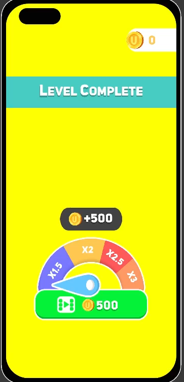
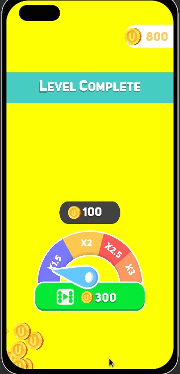

# Reward System with DOTween

This project provides a highly customizable reward animation system built using DOTween in Unity. 

## Features

- **Coin Animation**: Coins are animated to scale, rotate, and move towards a target using smooth easing.
- **Counter Animation**: A counter that dynamically updates with a yoyo effect, reflecting the rewards accumulated.
- **Hand Interaction**: A hand object punches or scales during interactions, providing tactile feedback.
- **Configurable**: Parameters like move duration, scale duration, and delays are fully customizable.
* Auto click Prevented
  * You can change click function with different thing. 

## Installation

1. Download and import the `ProjectPack.unitypackage` file into your Unity project.

## Licence

* Free to use and modify for personal and commercial projects.
  * Attribution is not required, but appreciated.

